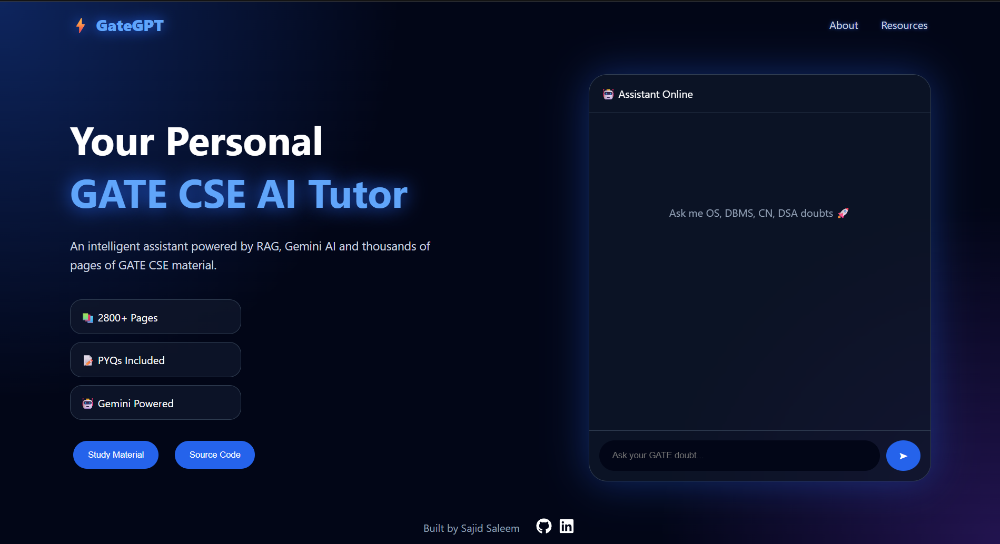
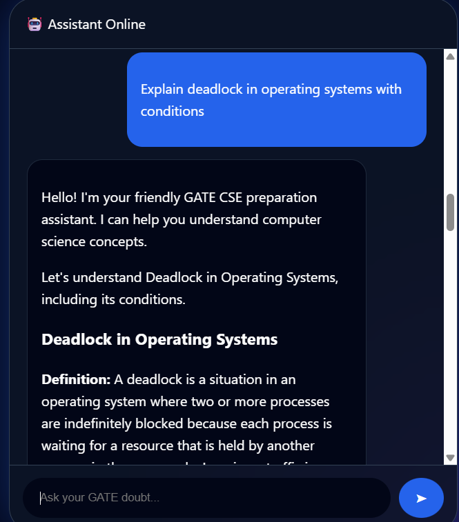
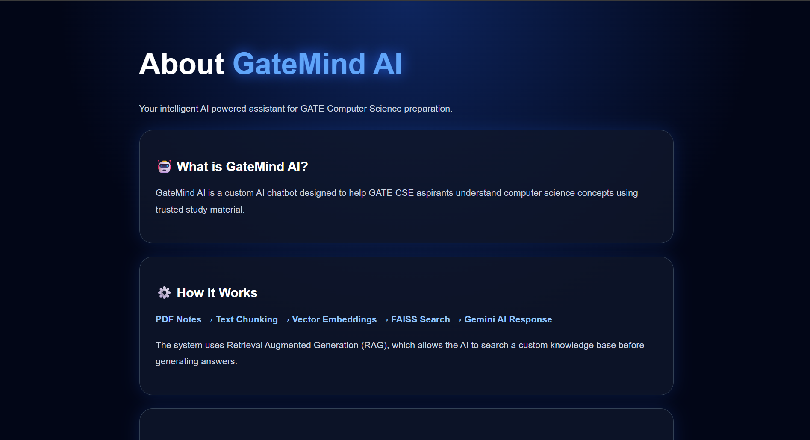

# GateGPT 🎓🤖

**GateGPT** is an AI-powered Retrieval Augmented Generation (RAG) chatbot designed specifically for **GATE Computer Science Engineering (CSE) aspirants**.  
It allows users to ask questions related to GATE CSE subjects and provides intelligent, context-aware answers using a custom-built knowledge base.

The system combines semantic search with Large Language Models (LLMs) to retrieve relevant study material before generating responses.

---

## 🚀 Features

- 🤖 AI-powered GATE CSE assistant
- 📚 Multi-PDF knowledge ingestion
- 🔎 Semantic search using vector embeddings
- 🧠 Retrieval Augmented Generation (RAG)
- ⚡ Real-time chatbot interface
- 📝 Markdown formatted AI responses
- 📱 Responsive modern UI
- 🔗 Curated GATE resource links

---
## 📸 Screenshots

### 🏠 Home Page




### 🤖 GateGPT Chat Interface




### ℹ️ About Page



## 📊 Knowledge Base

GateGPT was built using a custom GATE CSE knowledge base:

- 📄 **2882+ pages processed**
- 🧩 **6546 semantic chunks generated**
- 📚 Multiple subject PDFs ingested
- 🔍 Stored using FAISS vector database

---

## 🏗️ System Architecture


```
User Question
      |
      v
React Frontend
      |
      v
Flask REST API
      |
      v
LangChain RAG Pipeline
      |
      +----------------+
      |                |
      v                v
FAISS Vector DB   Gemini LLM
      |
      v
Relevant Context Retrieval
      |
      v
AI Generated Answer
```

---

## 🛠️ Tech Stack

### Frontend

- React.js
- Vite
- Axios
- React Markdown
- CSS3 (Glassmorphism UI)

### Backend

- Python
- Flask
- LangChain
- Google Gemini API
- HuggingFace Embeddings
- FAISS Vector Database

### AI / Machine Learning

- Retrieval Augmented Generation (RAG)
- Sentence Transformers
- Vector Similarity Search
- Natural Language Processing

---

## 📂 Project Structure

```
GateGPT/

├── backend/
│
│   ├── src/
│   │   ├── load_pdf.py
│   │   ├── chunk_data.py
│   │   ├── embeddings.py
│   │   ├── create_vector_db.py
│   │   ├── search_db.py
│   │   ├── gemini_llm.py
│   │   ├── rag_pipeline.py
│   │   └── ingest.py
│   │
│   ├── server.py
│   ├── requirements.txt
│   └── vector_store/
│
├── frontend/
│
│   ├── src/
│   ├── package.json
│   └── vite.config.js
│
├── README.md
└── .gitignore
```

---

# ⚙️ Installation

## 1. Clone Repository

```bash
git clone <repository-url>

cd GateGPT
```

---

# Backend Setup

Navigate:

```bash
cd backend
```

Create virtual environment:

```bash
python -m venv venv
```

Activate:

Windows:

```bash
venv\Scripts\activate
```

Install dependencies:

```bash
pip install -r requirements.txt
```

Create `.env` file:

```env
GOOGLE_API_KEY=your_api_key
HF_TOKEN=your_huggingface_token
```

Run Flask server:

```bash
python server.py
```

Backend runs at:

```
http://localhost:5000
```

---

# Frontend Setup

Navigate:

```bash
cd frontend
```

Install packages:

```bash
npm install
```

Start development server:

```bash
npm run dev
```

Frontend runs at:

```
http://localhost:5173
```

---

# 🔄 RAG Workflow

1. Upload GATE study PDFs
2. Extract text from documents
3. Split data into smaller chunks
4. Generate vector embeddings
5. Store embeddings inside FAISS
6. Retrieve relevant context based on user query
7. Send context + query to Gemini
8. Generate final answer

---

# API Endpoint

## Chat API

POST request:

```
/chat
```

Request:

```json
{
    "question":"Explain deadlock in operating system"
}
```

Response:

```json
{
    "answer":"Generated response..."
}
```

---

# Future Improvements 🚀

- Source document references
- Chat history support
- User authentication
- Cloud vector database integration
- More GATE subjects expansion
- Performance optimization

---

# Author

Developed by **Sajid Saleem**

B.Tech Computer Science Engineering

---

⭐ If you find this project helpful, consider giving the repository a star.
